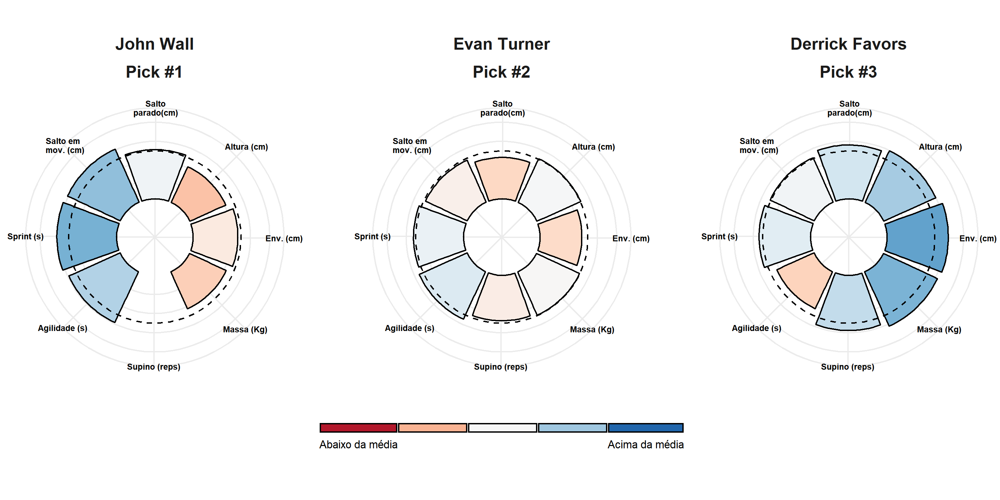
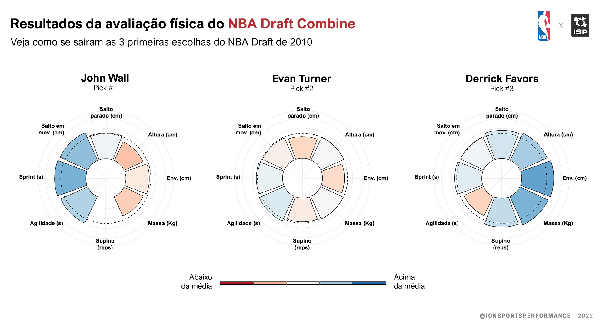

Quando avaliamos um grupo de atletas, precisamos saber quais as principais características de cada um(a) e as principais diferenças entre eles(as). Para isso, existem algumas maneiras de processamento e visualização dos dados que nos trazem essas informações de maneira rápida e intuitiva. Hoje nós vamos usar o R para explorar algumas informações antropométricas e de desempenho do [**NBA Draft Combine**](https://www.nba.com/stats/draft/combine/) e visualizar as características de cada atleta em relação ao grupo.

Para isso, passaremos por duas etapas: processamento e visualização dos dados. Na primeira calcularemos uma medida que normalizará os resultados do grupo para que possamos analisar cada atleta em relação a seus pares. Em seguida, alteraremos a estrutura dos nossos dados para uma seja mais amigável para o pacote `ggplot2` construir nossos gráficos.

------------------------------------------------------------------------

### Processando os dados

Eu selecionei as seguintes variáveis: **altura (cm)**, **massa (Kg)**, **envergadura (cm)**, **altura de salto parado (cm)**, **altura de salto em movimento (cm)**, **repetições no supino (n)**, **teste de agilidade (s)** e **sprint (s)**. Depois de carregar os dados no R, vamos dar uma olhada nas primeiras linhas:


```r
knitr::kable(head(draft,5), format = "html", digits = 2)
```

<table>
 <thead>
  <tr>
   <th style="text-align:left;"> Atleta </th>
   <th style="text-align:right;"> Pick </th>
   <th style="text-align:right;"> Ano </th>
   <th style="text-align:right;"> Altura (cm) </th>
   <th style="text-align:right;"> Envergadura (cm) </th>
   <th style="text-align:right;"> Massa (Kg) </th>
   <th style="text-align:right;"> Supino (reps) </th>
   <th style="text-align:right;"> Agilidade (s) </th>
   <th style="text-align:right;"> Sprint (s) </th>
   <th style="text-align:right;"> Salto em mov. (cm) </th>
   <th style="text-align:right;"> Salto parado (cm) </th>
  </tr>
 </thead>
<tbody>
  <tr>
   <td style="text-align:left;"> Blake Griffin </td>
   <td style="text-align:right;"> 1 </td>
   <td style="text-align:right;"> 2009 </td>
   <td style="text-align:right;"> 204.47 </td>
   <td style="text-align:right;"> 211.46 </td>
   <td style="text-align:right;"> 112.49 </td>
   <td style="text-align:right;"> 22 </td>
   <td style="text-align:right;"> 10.95 </td>
   <td style="text-align:right;"> 3.28 </td>
   <td style="text-align:right;"> 90.17 </td>
   <td style="text-align:right;"> 81.28 </td>
  </tr>
  <tr>
   <td style="text-align:left;"> Terrence Williams </td>
   <td style="text-align:right;"> 11 </td>
   <td style="text-align:right;"> 2009 </td>
   <td style="text-align:right;"> 195.58 </td>
   <td style="text-align:right;"> 205.74 </td>
   <td style="text-align:right;"> 96.62 </td>
   <td style="text-align:right;"> 9 </td>
   <td style="text-align:right;"> 11.15 </td>
   <td style="text-align:right;"> 3.18 </td>
   <td style="text-align:right;"> 93.98 </td>
   <td style="text-align:right;"> 77.47 </td>
  </tr>
  <tr>
   <td style="text-align:left;"> Gerald Henderson </td>
   <td style="text-align:right;"> 12 </td>
   <td style="text-align:right;"> 2009 </td>
   <td style="text-align:right;"> 193.04 </td>
   <td style="text-align:right;"> 208.92 </td>
   <td style="text-align:right;"> 97.52 </td>
   <td style="text-align:right;"> 8 </td>
   <td style="text-align:right;"> 11.17 </td>
   <td style="text-align:right;"> 3.14 </td>
   <td style="text-align:right;"> 88.90 </td>
   <td style="text-align:right;"> 80.01 </td>
  </tr>
  <tr>
   <td style="text-align:left;"> Tyler Hansbrough </td>
   <td style="text-align:right;"> 13 </td>
   <td style="text-align:right;"> 2009 </td>
   <td style="text-align:right;"> 203.84 </td>
   <td style="text-align:right;"> 212.09 </td>
   <td style="text-align:right;"> 106.14 </td>
   <td style="text-align:right;"> 18 </td>
   <td style="text-align:right;"> 11.12 </td>
   <td style="text-align:right;"> 3.27 </td>
   <td style="text-align:right;"> 86.36 </td>
   <td style="text-align:right;"> 69.85 </td>
  </tr>
  <tr>
   <td style="text-align:left;"> Earl Clark </td>
   <td style="text-align:right;"> 14 </td>
   <td style="text-align:right;"> 2009 </td>
   <td style="text-align:right;"> 204.47 </td>
   <td style="text-align:right;"> 219.71 </td>
   <td style="text-align:right;"> 103.42 </td>
   <td style="text-align:right;"> 5 </td>
   <td style="text-align:right;"> 11.17 </td>
   <td style="text-align:right;"> 3.35 </td>
   <td style="text-align:right;"> 83.82 </td>
   <td style="text-align:right;"> 72.39 </td>
  </tr>
</tbody>
</table>

O próximo passo é normalizar essas variáveis para que possamos fazer comparações entre os atletas em relação a média do grupo. Para fazer isso, vamos por etapas. Primeiro, vamos utilizar a função `scale()` para transformar nossas variáveis em Z-Score (a função fará isso separadamente para cada coluna que indicarmos).


```r
draft[,4:11] <- scale(draft[,4:11])
```

Em seguida, vamos transformar esses valores em T-Scores com a fórmula abaixo.


```r
draft[,4:11] <- (draft[,4:11] * 10) + 50
```

Temos agora os T-Scores de cada variável para todos os atletas. O valor 50 representa a média do grupo (Z-Score = 0) e a distância de 10 unidades representa 1 desvio-padrão (DP) acima ou abaixo da média. Portanto, no T-Score, é comum que a maior parte dos valores caiam entre 20 e 80 (até 3 DP).

Precisamos lembrar que algumas das variáveis selecionadas estão em tempo (s) e, nos nossos testes, o menor tempo indica um melhor desempenho - ao contrário das outras medidas. Portanto, para que os T-Scores indiquem igualmente a condição de um desempenho "bom" ou "ruim", inverteremos (100 - T-Score) os valores das variáveis medidas em tempo. Dessa forma, temos que valores acima de 50 representam um "desempenho" acima da média. Vamos dar uma olhada no que temos até agora:


```r
knitr::kable(head(draft,11), format = "html", digits = 1)
```

<table>
 <thead>
  <tr>
   <th style="text-align:left;"> Atleta </th>
   <th style="text-align:right;"> Pick </th>
   <th style="text-align:right;"> Ano </th>
   <th style="text-align:right;"> Altura (cm) </th>
   <th style="text-align:right;"> Envergadura (cm) </th>
   <th style="text-align:right;"> Massa (Kg) </th>
   <th style="text-align:right;"> Supino (reps) </th>
   <th style="text-align:right;"> Agilidade (s) </th>
   <th style="text-align:right;"> Sprint (s) </th>
   <th style="text-align:right;"> Salto em mov. (cm) </th>
   <th style="text-align:right;"> Salto parado (cm) </th>
  </tr>
 </thead>
<tbody>
  <tr>
   <td style="text-align:left;"> Blake Griffin </td>
   <td style="text-align:right;"> 1 </td>
   <td style="text-align:right;"> 2009 </td>
   <td style="text-align:right;"> 58.8 </td>
   <td style="text-align:right;"> 51.9 </td>
   <td style="text-align:right;"> 63.4 </td>
   <td style="text-align:right;"> 73.8 </td>
   <td style="text-align:right;"> 56.8 </td>
   <td style="text-align:right;"> 51.5 </td>
   <td style="text-align:right;"> 51.0 </td>
   <td style="text-align:right;"> 57.9 </td>
  </tr>
  <tr>
   <td style="text-align:left;"> Terrence Williams </td>
   <td style="text-align:right;"> 11 </td>
   <td style="text-align:right;"> 2009 </td>
   <td style="text-align:right;"> 48.1 </td>
   <td style="text-align:right;"> 46.2 </td>
   <td style="text-align:right;"> 49.3 </td>
   <td style="text-align:right;"> 47.5 </td>
   <td style="text-align:right;"> 53.2 </td>
   <td style="text-align:right;"> 59.3 </td>
   <td style="text-align:right;"> 55.2 </td>
   <td style="text-align:right;"> 53.0 </td>
  </tr>
  <tr>
   <td style="text-align:left;"> Gerald Henderson </td>
   <td style="text-align:right;"> 12 </td>
   <td style="text-align:right;"> 2009 </td>
   <td style="text-align:right;"> 45.1 </td>
   <td style="text-align:right;"> 49.4 </td>
   <td style="text-align:right;"> 50.1 </td>
   <td style="text-align:right;"> 45.5 </td>
   <td style="text-align:right;"> 52.8 </td>
   <td style="text-align:right;"> 62.4 </td>
   <td style="text-align:right;"> 49.6 </td>
   <td style="text-align:right;"> 56.3 </td>
  </tr>
  <tr>
   <td style="text-align:left;"> Tyler Hansbrough </td>
   <td style="text-align:right;"> 13 </td>
   <td style="text-align:right;"> 2009 </td>
   <td style="text-align:right;"> 58.0 </td>
   <td style="text-align:right;"> 52.5 </td>
   <td style="text-align:right;"> 57.8 </td>
   <td style="text-align:right;"> 65.7 </td>
   <td style="text-align:right;"> 53.7 </td>
   <td style="text-align:right;"> 52.3 </td>
   <td style="text-align:right;"> 46.8 </td>
   <td style="text-align:right;"> 43.2 </td>
  </tr>
  <tr>
   <td style="text-align:left;"> Earl Clark </td>
   <td style="text-align:right;"> 14 </td>
   <td style="text-align:right;"> 2009 </td>
   <td style="text-align:right;"> 58.8 </td>
   <td style="text-align:right;"> 60.2 </td>
   <td style="text-align:right;"> 55.3 </td>
   <td style="text-align:right;"> 39.4 </td>
   <td style="text-align:right;"> 52.8 </td>
   <td style="text-align:right;"> 46.1 </td>
   <td style="text-align:right;"> 44.0 </td>
   <td style="text-align:right;"> 46.4 </td>
  </tr>
  <tr>
   <td style="text-align:left;"> Austin Daye </td>
   <td style="text-align:right;"> 15 </td>
   <td style="text-align:right;"> 2009 </td>
   <td style="text-align:right;"> 62.6 </td>
   <td style="text-align:right;"> 60.8 </td>
   <td style="text-align:right;"> 40.7 </td>
   <td style="text-align:right;"> NA </td>
   <td style="text-align:right;"> 36.2 </td>
   <td style="text-align:right;"> 30.5 </td>
   <td style="text-align:right;"> 30.0 </td>
   <td style="text-align:right;"> 35.0 </td>
  </tr>
  <tr>
   <td style="text-align:left;"> James Johnson </td>
   <td style="text-align:right;"> 16 </td>
   <td style="text-align:right;"> 2009 </td>
   <td style="text-align:right;"> 54.2 </td>
   <td style="text-align:right;"> 55.7 </td>
   <td style="text-align:right;"> 67.1 </td>
   <td style="text-align:right;"> 65.7 </td>
   <td style="text-align:right;"> 52.1 </td>
   <td style="text-align:right;"> 55.4 </td>
   <td style="text-align:right;"> 49.6 </td>
   <td style="text-align:right;"> 53.0 </td>
  </tr>
  <tr>
   <td style="text-align:left;"> Jrue Holiday </td>
   <td style="text-align:right;"> 17 </td>
   <td style="text-align:right;"> 2009 </td>
   <td style="text-align:right;"> 42.8 </td>
   <td style="text-align:right;"> 41.1 </td>
   <td style="text-align:right;"> 43.6 </td>
   <td style="text-align:right;"> 41.4 </td>
   <td style="text-align:right;"> 62.3 </td>
   <td style="text-align:right;"> 57.0 </td>
   <td style="text-align:right;"> 46.8 </td>
   <td style="text-align:right;"> 46.4 </td>
  </tr>
  <tr>
   <td style="text-align:left;"> Ty Lawson </td>
   <td style="text-align:right;"> 18 </td>
   <td style="text-align:right;"> 2009 </td>
   <td style="text-align:right;"> 30.7 </td>
   <td style="text-align:right;"> 25.3 </td>
   <td style="text-align:right;"> 42.8 </td>
   <td style="text-align:right;"> 57.6 </td>
   <td style="text-align:right;"> 56.2 </td>
   <td style="text-align:right;"> 64.0 </td>
   <td style="text-align:right;"> 53.8 </td>
   <td style="text-align:right;"> 48.1 </td>
  </tr>
  <tr>
   <td style="text-align:left;"> Jeff Teague </td>
   <td style="text-align:right;"> 19 </td>
   <td style="text-align:right;"> 2009 </td>
   <td style="text-align:right;"> 33.7 </td>
   <td style="text-align:right;"> 42.4 </td>
   <td style="text-align:right;"> 33.9 </td>
   <td style="text-align:right;"> 55.6 </td>
   <td style="text-align:right;"> 55.0 </td>
   <td style="text-align:right;"> 59.3 </td>
   <td style="text-align:right;"> 53.8 </td>
   <td style="text-align:right;"> 53.0 </td>
  </tr>
  <tr>
   <td style="text-align:left;"> Hasheem Thabeet </td>
   <td style="text-align:right;"> 2 </td>
   <td style="text-align:right;"> 2009 </td>
   <td style="text-align:right;"> 73.2 </td>
   <td style="text-align:right;"> 69.7 </td>
   <td style="text-align:right;"> 71.1 </td>
   <td style="text-align:right;"> NA </td>
   <td style="text-align:right;"> NA </td>
   <td style="text-align:right;"> NA </td>
   <td style="text-align:right;"> NA </td>
   <td style="text-align:right;"> NA </td>
  </tr>
</tbody>
</table>

Quase tudo pronto para plotarmos! Antes disso, precisamos colocar os dados em uma estrutura diferente. Ao invés de termos uma coluna para cada variável, nós "empilharemos" essas variáveis e repetiremos as informações que identificam cada atleta (Atleta, Ano e Pick). Para fazer isso, utilizaremos a função `melt()` do pacote `reshape2`. Essa função pede cinco argumentos:

> `x =` O objeto que será modificado
>
> `id.vars =` As variáveis de identificação *(nome, grupo etc)*
>
> `measure.vars =` As variáveis que serão empilhadas
>
> `variable.name =` O nome da nova coluna de variáveis
>
> `value.name =` O nome da nova coluna com os valores de cada variável


```r
library(reshape2)

df <- melt(draft, # Nossos dados até agora
           id.vars = c("Atleta", "Ano", "Pick"), # Variáveis de identificação
           variable.name = "Variavel", # Nome da coluna das variaveis
           value.name = "TS") # Nome da coluna dos valores de cada variavel
```

> Reparem que eu não especifiquei as measure.vars - a função entende que as colunas que eu não especifiquei como id.vars devem ser consideradas as variáveis a serem "empilhadas".

### Visualizando os dados

Para visualizar esses dados, utlizaremos um ["gráfico de barras circular"](https://r-graph-gallery.com/web-circular-barplot-with-R-and-ggplot2.html) que servirá muito bem aos nossos objetivos. Para construir esse tipo de gráfico, vamos utilizar o pacote `ggplot2` - que está dentro pacote `tidyverse`.

Vamos começar a construir o gráfico utilizando apenas os dados de um atleta. Reparem que no código abaixo eu filtro nossos dados pelo nome do atleta que está na primeira linha. Essa mesma função nos servirá depois para olhar os dados de um atleta específico ou de um grupo de atletas.


```r
library(tidyverse)

df %>% filter(Atleta %in% head(x = df$Atleta, 1)) %>%
  ggplot() +
  geom_col(aes(x = Variavel, y = TS, fill = TS)) +
  geom_hline(yintercept = 50, linetype = "dashed")
```


Ainda parece meio bagunçado... mas já fizemos alguma coisa. 😅

Desenhamos uma linha pontilhada indicando o valor 50. Então já temos que este atleta está um pouco acima da média na maioria das variáveis. Vamos tornar esse gráfico circular utilizando a função `coord_polar()` e exibir o nome do atleta utilizando a função `facet_wrap()`.


```r
df %>% filter(Atleta %in% head(x = df$Atleta, 1)) %>%
  ggplot() +
  geom_col(aes(x = Variavel, y = TS, fill = TS)) +
  geom_hline(yintercept = 50, linetype = "dashed") +
  coord_polar(clip = "off") +
  facet_wrap(~Atleta)
```


Estamos chegando lá! Vamos modificar um pouco esse gráfico dando atenção especial aos limites do eixo Y e as cores que indicam a magnitude to T-Score. Como sabemos que a maior parte dos valores cairá entre 20 e 80 (3 DP), podemos definir esses valores como o limite inferior e superior do eixo, respectivamente.


```r
df %>% filter(Atleta %in% head(x = df$Atleta, 1)) %>%
  ggplot() +
  geom_col(aes(x = Variavel, y = TS, fill = TS), color = "black") +
  geom_hline(yintercept = 50, linetype = "dashed") +
  coord_polar(clip = "off", start = .4) +
  scale_fill_distiller(palette = "RdBu", direction = 1,
                       limits = c(30,80)) +
  scale_y_continuous(
    limits = c(-40, 80),
    expand = c(0, 0),
    breaks = c(20, 40, 60, 80)
  ) + 
  theme_minimal() +
  facet_grid(~Atleta) +
  theme(
    axis.title = element_blank(),
    axis.ticks = element_blank(),
    axis.text.y = element_blank(),
    axis.text.x = element_text(size = 8),
    text = element_text(size = 18),
    legend.position = "none",
    panel.spacing = unit(3, "lines")
  )
```


Agora que construímos o gráfico utilizando as informações de apenas um atleta e de suas características em relação ao grupo avaliado, podemos brincar com as opções de customização do `ggplot2` e plotar um grupo de atletas lado a lado. Para fazer isso, basta alterar a **primeira linha** do gráfico onde utilizamos a função `filter()` para selecionar o primeiro atleta da tabela. Vamos plotar as 3 primeiras escolhas do NBA Draft de 2010 utlizando essa função (linha baixo) - o código completo do gráfico abaixo você encontra no final desse post.


```r
df %>% filter(Pick %in% c(1:3), Ano == 2010)
```



Vimos que calcular medidas como o Z-Score e T-Score é relativamente fácil no R e elas podem ser muito úteis para comparar os atletas em relação ao grupo avaliado e detectar os "destaques" pra cada variável. Ainda, um gráfico de barras circular pode ser facilmente construído com a função `coord_polar`. A partir daí, podemos brincar com os diferentes parâmetros do `ggplot2` para criar figuras mais eficientes e intuitivas de acordo com os nossos objetivos. Eu recomendo [essa lista de tutoriais](http://r-statistics.co/Top50-Ggplot2-Visualizations-MasterList-R-Code.html) que cobre cada aspecto do `ggplot2`, dependendo tipo de informação que você quer mostrar. Abaixo está a versão final do gráfico, construída alterando alguns desses parâmetros. Bons estudos **🤓**



> <details>
>
> <summary>
>
> *Código completo do gráfico (clique para ver):*
>
> </summary>
>
> 
> ```r
> library(forcats)
> 
> pick.labs = c("Pick #1", "Pick #2", "Pick #3")
> names(pick.labs) <- c(1,2,3)
> 
> df %>% filter(Pick %in% c(1:3), Ano == 2010) %>%
>   ggplot() +
>   geom_col(aes(x = Variavel, y = TS, fill = TS), color = "black") +
>   geom_hline(yintercept = 50, linetype = "dashed") +
>   coord_polar(clip = "off", start = .4) +
>   
>   
>   scale_fill_distiller(palette = "RdBu", direction = 1,
>                        limits = c(30,70),
>                        labels = c("Abaixo da média", " ", " ", " ", "Acima da média")) +
>   scale_y_continuous(
>     limits = c(-40, 80),
>     expand = c(0, 0),
>     breaks = c(20, 40, 60, 80)) + 
>   
>   scale_x_discrete(labels=c("Envergadura (cm)" = "Env. (cm)", 
>                             "Salto em mov. (cm)" = "Salto em \n mov. (cm)",
>                             "Salto parado (cm)" = "Salto\nparado(cm)")) +
>   
>   theme_minimal() +
>   
>   facet_wrap(~fct_relevel(Atleta, 'John Wall', 'Evan Turner', 'Derrick Favors') + Pick, 
>              nrow = 1, labeller = labeller(Pick = pick.labs)) +
>   
>   guides(fill=guide_legend(
>     label.position = 'bottom', 
>     title.position = 'top',
>     keywidth=.7,
>     label.theme = element_text(size = 8, color = "black"),
>     title.theme = element_blank(),
>     keyheight= .10,
>     default.unit="inch", 
>     title.hjust = .5,
>     title.vjust = 0,
>     label.vjust = 3,
>     nrow = 1)) +
> 
>   theme(
>     # Removendo os títulos e textos dos eixos
>     axis.title = element_blank(),
>     axis.ticks = element_blank(),
>     axis.text.y = element_blank(),
>     axis.text.x = element_text(size = 6, face = "bold", color = "black", vjust = 2),
>     text = element_text(size = 16),
>     legend.position = "bottom",
>     panel.spacing = unit(3, "lines"),
>     legend.spacing.x = unit(0, 'cm'),
>     plot.background = element_rect(fill = "white", color = "white"),
>     strip.text = element_text(size = 12, vjust = 3, face = "bold"),
>   )
> ```
> 
> ```
> ## Warning: Removed 1 rows containing missing values (position_stack).
> ```
> 
> 
>
> </details>
