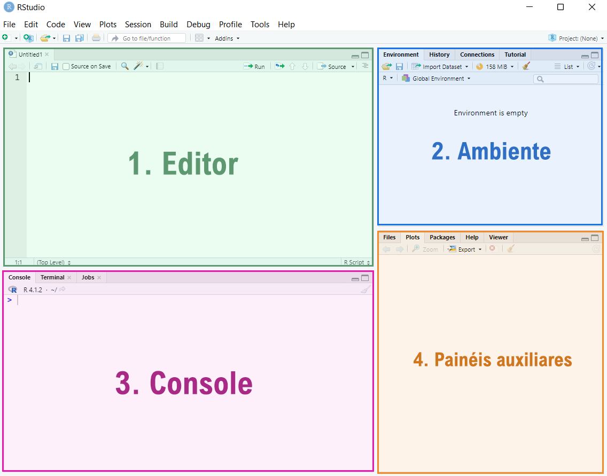
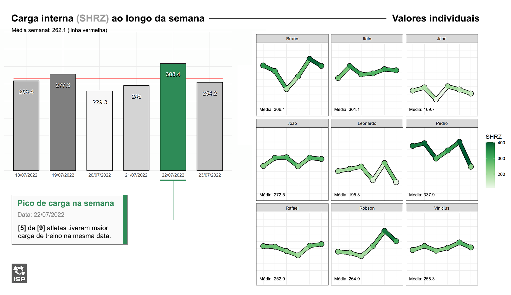

```{r echo=FALSE, include = FALSE, message = FALSE}

knitr::opts_chunk$set(comment = '', prompt = FALSE)

# Pacotes necessarios para o post aqui
library(tidyverse)
```

`por Bruno Giovanini`

## **Contexto**

Eu entrei em contato com o R e o RStudio pela primeira vez em 2018. Na época, eu estava aprendendo a realizar análises estatísticas para fins acadêmicos. E até que deu certo - eu sabia exatamente como fazer um **teste t** ou uma **ANOVA** no R, mas a linguagem ainda era um pouco confusa pra mim. Eu não sabia o porquê de algumas (*muitas*) coisas. Quando a análise não ia como esperado, eu tinha muita dificuldade em resolver e, quando não desistia, ia aos trancos e barrancos depois de muito apostar na "tentativa e erro". Até aqui eu tinha certeza: **eu não vou usar o R pra NADA além disso.**

## **Um ano depois...**

O ano era 2019. Meu relacionamento com o R havia melhorado, mas ainda ficávamos apenas na estatística. Eu não queria nada sério 🤷. No trabalho, eu usava papel, caneta e o Excel para organizar os dados de carga de treino. E funcionava bem. No entanto, toda vez que eu precisava consultar ou até mesmo mostrar os dados de treinamento/recuperação para alguém de outro departamento, eu precisava sentar, abrir o computador, abrir o Excel, calcular as variáveis e mostrar os resultados. E as vezes isso atrasava ou prejudicava algumas decisões que precisávamos tomar (*e era um saco*).

Até que eu esbarrei no pacote **`{shiny}`** do RStudio. Esse pacote permitiria integrar as análises feitas no R com a construção de páginas interativas na web. E daí veio a primeira ideia: ao invés de ter que abrir o computador e o Excel toda vez para consultar e calcular carga de treino, eu posso ter um **app online** que atualiza e calcula esses valores automaticamente. **E bônus: todos da comissão técnica poderiam ter acesso**. Isso facilitaria a troca de informações entre departamentos e eu teria acesso às informações rapidamente e de uma forma mais confiável.

**Eu confesso que não sei de onde saiu a confiança pra ter essa ideia.** Eu basicamente queria construir um foguete sem nem entender como um motor funciona. Mas ainda assim me parecia possível: eu achava que tinha alguma familiaridade com o R; eu tinha o Google (*e o Stack OverFlow* 🙏) pra me ajudar; era um recurso gratuito (sem despesas pro meu clube 😬), então decidi que valeria a pena tentar a sorte nesse caminho.

## **E agora?**

Aprender uma linguagem de programação não é fácil. Mas eu tinha um caminho por onde ir - eu precisava resolver um problema específico. E tudo o que eu estava aprendendo era para me ajudar nisso. Então antes mesmo de aprender a usar o pacote **`{shiny}`**, eu precisava primeiro aprender a como **organizar meus dados**, **calcular as variáveis de interesse** e **agrupá-las por tempo** tal como eu fazia no Excel - o básico, mas no R.

> **✨ Então a nossa jornada começa por aqui.** Eu vou te mostrar como eu resolvi esses problemas enquanto te ensino as funcionalidades básicas do R para monitoramento de carga no esporte. ✨

## **O básico do R**

### Instalação do R e RStudio

Você precisa instalar o R e o RStudio para colocar a mão na massa. O R é a linguagem de programação enquanto o RStudio é a interface para R que facilita nossa vida. [**Clique aqui para receber as instruções de como instalar o R e o RStudio pela primeira vez.**](/post/instalacao-do-r-e-rstudio/)

### Interface do RStudio



1.  **Editor:** um dos painéis principais. Aqui escreveremos nossos códigos (ou scripts) e podemos salvá-los para usar novamente mais tarde. Se, ao abrir o R, esse painél não estiver aberto, você pode abri-lo com o comando **Ctrl+Shift+N**.
2.  **Ambiente:** No ambiente serão armazenados todos os objetos criados na sessão. Quando salvamos um projeto, você pode fechar e reabrir o RStudio que os objetos criados ainda estarão lá.
3.  **Console:** outro painel principal. Aqui é onde o R acontece. Quando rodamos um código no Editor, o resultado (saída) é exibido aqui.
4.  **Painéis auxiliares:** Esse quadrante reúne painéis auxiliares. Quando rodamos um código que gera um gráfico, o resultado é exibido na aba **Plot**. Para visualizar a pasta do nosso projeto e quais os arquivos estão nela, usamos a aba **Files**. A aba **Packages** apresenta todos os pacotes instalados/carregados. Na aba **Help** podemos consultar a documentação de pacotes e funções para tirar dúvidas. Na aba **Viewer** são mostrados outputs interativos, como relatórios ou dashboards.

### Primeiros comandos no R

Vamos começar escrevendo um código no Editor. Para rodar uma linha de código, use o comando **Ctrl+Enter** após digitar o código. Podemos utilizar o R como calculadora e ver o resultado de operações simples no Console. Por exemplo:

```{r}
5 + 5
```

Executamos o comando `5 + 5` no Editor e vimos o resultado `10` no Console.

Pronto! Agora sabemos que o resultado de qualquer operação é sempre exibida no Console. Você pode testar outras operações simples como subtração (`-`), divisão (`/`), multiplicação (`*`) e potência (`^`).

### Objetos

Além de exibir no Console, podemos também guardar o resultado de alguma operação dentro de um **objeto**. Esse objeto pode ser um **vetor**, uma **tabela**, uma **matriz** ou até mesmo uma **lista** que guarda outros objetos.

Esses objetos guardarão nossos dados - que podem ser valores numéricos, de texto ou lógicos (verdadeiro ou falso).

Podemos guardar o resultado de uma operação usando o comando `<-` ou `=` . É possível visualizar o resultado guardado no objeto digitando o nome do objeto:

```{r}
# Guardando o resultado da operação '3 + 3' dentro de 'x'
x <- 3 + 3

# Visualizando o valor guardado no objeto 'x'
x
```

Você deve ter notado que o objeto `x` agora aparece no seu **Ambiente**, inclusive mostrando qual o valor guardado dentro dele.

#### Vetores

Vetores representam uma sequência indexada de valores. Com eles, podemos guardar múltiplos valores dentro de um objeto. Para criarmos um vetor, utilizamos a função `c()`, colocando os valores separados por vírgulas. Por exemplo:

```{r}
vetor <- c(5,6,7,8,9)
vetor
```

Já que criamos um `vetor` contendo 5 valores, cada valor está em uma 'posição' desse vetor. Nesse caso temos que o valor `5` está na posição 1, o valor `6` está na posição 2... e assim por diante. Então caso seja necessário acessar uma posição específica desse vetor, podemos fazê-lo usando colchetes `[]`.

```{r}
# Acessando a posição 1 do vetor
vetor[1]

# Acessando a posição 3 do vetor
vetor[3]

# Acessando da posição 3 a posição 5 do vetor
vetor[3:5]
```

Podemos também criar um vetor com valores de texto. Basta colocarmos nossos valores entre aspas:

```{r}
vetor.texto <- c("A", "B", "C")
vetor.texto
```

#### Tabelas

A **tabela**, ou *data frame*, é o principal tipo de objeto que vamos utilizar por aqui. Esse tipo de objeto tem a característica de ser formado por linhas e colunas.

Podemos fazer um *data frame* usando a função `data.frame()`. Dentro dessa função, precisamos nomear as colunas e qual a sequência de valores de cada coluna. Lembrando que todas as colunas devem ter o mesmo comprimento de valores. Por exemplo:

```{r}
# Criando um dataframe

df <- data.frame(coluna1 = c(1,2,3), # Definindo valores da coluna1
                 coluna2 = c("A", "B", "C")) # Definindo valores da coluna2
df
```

Você percebeu, né? Eu criei vetores para determinar os valores de cada coluna. Essa é outra característica do *data frame*: **cada coluna é representar por um vetor.**

### Funções

As funções são os comandos - dizemos ao R o que fazer com aquele objeto e podemos guardar o resultado ou simplesmente visualizá-lo no Console. Até agora usamos as funções `c()` e `data.frame()` para criar objetos. Podemos usar funções que agirão sobre objetos criados. Por exemplo, vamos usar a função `mean()` para calcular a média dos valores contidos no objeto `vetor`.

```{r}
# Calculando a média de vetor
mean(vetor)
```

A sintaxe de uma função é sempre composta pelo **nome da função** e por seus **argumentos** entre parênteses. Os argumentos, se houver mais de um, serão sempre separados por vírgula. A partir dos argumentos, a função realiza uma ação e devolve um resultado.

``` r
funcao(argumento1, argumento2)
```

Vamos exercitar o que temos até agora usando algumas funções para resolver problemas simples. Eis nosso primeiro desafio:

> 1.  **Criar uma tabela com as colunas Nome, Categoria, Altura).**
> 2.  **Acessar valores específicos dessa tabela.**
> 3.  **Calcular média e desvio-padrão da Altura de nossos atletas.**
> 4.  **Calcular média e desvio-padrão de cada categoria.**

### Criando uma tabela

Vamos criar uma tabela contendo dados de 9 atletas de 3 categorias diferentes: U15, U17 e U22. Pra cada atleta, precisamos computar um valor de altura (em metros). Vamos começar criando os 3 vetores que vão corresponder às colunas da nossa tabela.

```{r}
# Criando um vetor de 'Nomes' (texto)

vetor.nomes <- c("João", "Vitor", "Lucas", 
                 "Calebe", "Bruno", "Eduardo", 
                 "Pedro", "Luiz", "Fernando")

# Criando um vetor de 'Categoria' (texto)

vetor.categoria <- c("U15", "U15", "U15",
                     "U17", "U17", "U17",
                     "U22", "U22", "U22")

# Criando um vetor de 'Altura' (numérico)

vetor.altura <- c(1.65, 1.75, 1.71,
                  1.88, 1.79, 1.92,
                  1.85, 1.94, 2.02)
```

Pronto. Agora vamos usar a função `data.frame()` para criar a tabela e visualizá-la.

```{r}
tabela <- data.frame(Nome = vetor.nomes,
                     Categoria = vetor.categoria,
                     Altura = vetor.altura)

tabela
```

### Acessando valores de uma tabela

Assim como podemos acessar os valores de um vetor usando os colchetes, também podemos acessar o valor específico de uma tabela. Nesse caso, precisamos colocar duas informações entre colchetes, estritamente nessa ordem: o número da linha e o número da coluna.

```{r}
# Acessando o valor da quinta linha, terceira coluna:
tabela[5,3]
```

Caso seja necessário acessar **valores apenas de um conjunto de linhas ou colunas**, podemos deixar um espaço em branco antes ou depois da vírgula entre colchetes. Por exemplo:

```{r}
tabela[,3] # Acessa os valores de todas as linhas da coluna 3 (vetor)
tabela[2,] # Acessa os valores de todas as colunas da linha 2 (tabela)
```

Para filtrar os dados por valores específicos, podemos usar a função `subset()`. Essa função precisa de dois argumentos: o **objeto** a ser filtrado e a **expressão lógica**. Por exemplo, vamos somente acessar os dados do atleta **Calebe**.

```{r}
# Acessando os dados do Calebe
subset(tabela, Nome == "Calebe")
```

Reparem no comando dado para a função: *filtre os dados cujo os valores da coluna **'Nome'** sejam iguais a **'Calebe'**.* No R, o operador `==` representa o mesmo que "igual a". De forma semelhante, podemos filtrar os dados de apenas uma categoria.

```{r}
# Acessando os dados da categoria U17
subset(tabela, Categoria == "U17")
```

Outros exemplos de como usar operadores relacionais para acessar valores da nossa tabela:

```{r, include=FALSE}
subset(tabela, Altura > 1.80) # Atletas com mais de 1.80 m
subset(tabela, Categoria != "U22") # Apenas atletas que não são U22
```

Para encontrar valores que ainda não conhecemos dentro de nossa tabela, como valores máximos ou mínimos de alguma variável, podemos combinar as funções `subset()` com as funções `max()` e `min()`.

```{r}
# Encontrando o atleta mais alto do grupo
subset(tabela, Altura == max(Altura))
# Encontrando o atleta mais baixo do grupo
subset(tabela, Altura == min(Altura))
```

### Calculando média e desvio-padrão

Agora que sabemos quem é o mais alto e o mais baixo, vamos calcular a altura média desses atletas e a dispersão usando o desvio-padrão. Pra isso, vamos usar as funções `mean()` e `sd()`.

Um operador que ainda não conhecemos é o `$`. Com esse operador, podemos acessar os valores de uma determinada coluna de nossa tabela pelo nome. Por exemplo:

```{r}
tabela$Nome
```

Vamos usar o operador `$` para calcular a média e o desvio-padrão da altura de nossos atletas.

```{r}
# Calculando a média de altura de nossos atletas
mean(tabela$Altura)
# Calculando o desvio-padrão de altura de nossos atletas
sd(tabela$Altura)
```

Pronto! Temos que a altura média do nosso grupo é **`1.83 m`** com um desvio padrão de **`0.12 m`**.

### Calculando a média e desvio-padrão por categoria

Sabemos a média e desvio-padrão da altura do nosso grupo... mas agora precisamos calcular esses valores por categoria. Uma maneira de fazer isso seria filtrar a tabela por cada categoria e aplicar os passos anteriores. **Mas vamos fazer diferente** 🤓.

Vamos usar a função `aggregate()` para agrupar nossos dados de acordo com a **Categoria** e, dentro da função `aggregate()`, indicar outra função para agir sobre os dados agrupados.

```{r}
# Agrupando os valores de altura por categoria e calculando a média
aggregate(Altura ~ Categoria, data = tabela, FUN = mean)
```

No primeiro argumento, temos a variável de interesse em relação ao grupo `(Altura ~ Categoria)`. O segundo argumento pede o objeto de origem desses dados, no caso, `tabela`. O argumento `FUN =` pede a função que agirá sobre a variável de interesse.

Vamos repetir o passo anterior, agora calculando o desvio-padrão por categoria. Para isso, basta alterar o argumento `FUN =`.

```{r}
# Agrupando os valores de altura por categoria e calculando a média
aggregate(Altura ~ Categoria, data = tabela, FUN = sd)
```

Pronto! Para finalizar esta etapa, vamos unir as duas tabelas em uma só. Para isso, vamos usar a função `merge()` . Essa função "junta" duas tabelas utilizando uma coluna comum entre as duas.

```{r}
# Guardando a média/dp por categoria em novos data frames
media.grupos <- aggregate(Altura ~ Categoria, data = tabela, FUN = mean)
dp.grupos <- aggregate(Altura ~ Categoria, data = tabela, FUN = sd)

# Unindo as duas tabelas pela coluna em comum
df.final <- merge(media.grupos, dp.grupos, by = "Categoria")
df.final
```

Como as duas tabelas tinham uma coluna de nome **`Altura`**, mas com valores diferentes, a função `merge()` as diferencia adicionando um **".x"** e um **".y"** ao final do nome. Como sabemos o que cada coluna representa, podemos usar outra função para renomear essas colunas. Vamos utilizar a função `names()`.

Essa função acessa os nomes das colunas de um objeto e retorna esses valores com um vetor de texto. Para alterar o nome de uma coluna, acessamos um valor desse vetor de nomes e atribuímos um novo valor com o operador `<-`.

```{r}
# Acessando os nomes do df.final
names(df.final)

# Queremos alterar os nomes da segunda e terceira coluna, portanto:
names(df.final)[2] <- "Média"
names(df.final)[3] <- "DP"

df.final
```

## **Trabalhando com dados reais**

Até aqui fizemos operações simples mas eficazes pra resolver muitos problemas do dia-a-dia. Vamos trabalhar com dados reais para solucionar algumas questões no monitoramento de carga. Para baixar os dados, [**clique aqui**](#).

Temos o seguinte cenário: recebemos os dados de carga interna correspondentes a uma semana de treinamento de uma equipe. Daiane, a preparadora física, precisa de um resumo dessa semana para conferir se as cargas realizadas foram ao encontro das cargas planejadas. Vamos calcular no R as seguintes variáveis e apresentá-las a Daiane:

> • Média da carga semanal do grupo\
> • Média da carga semanal individual\
> • Média da carga do grupo ao longo da semana\
> • Valores individuais ao longo da semana\
> • Qual o dia da semana com a maior carga média?\
> • Para quantos atletas esse dia foi o de maior carga da semana?


### Preparando os dados

Recebemos dados de carga interna de nove atletas de uma equipe. Os dados estão descritos em tempo gasto em cada zona de frequência cardíaca. Embora tenhamos muitas opções a partir daqui, vamos calcular a variável SHRZ (Summated Heart Rate Zones)[^1] e conduzir nossa análise a partir dela. Vamos aos dados:

[^1]: Aaron T. Scanlan, Jordan L. Fox, Jacqueline L. Poole, Daniele Conte, Zoran Milanović, Michele Lastella & Vincent J. Dalbo (2018) A comparison of traditional and modified Summated-Heart-Rate-Zones models to measure internal training load in basketball players, Measurement in Physical Education and Exercise Science, 22:4, 303-309, DOI: [10.1080/1091367X.2018.1445089](https://doi.org/10.1080/1091367X.2018.1445089)

```{r, echo = FALSE, include = FALSE, message=FALSE}
# Criando nova variavel para o volume de cada sessão
carga <- read.csv("cargasemanal.csv", encoding = "Latin-1", sep = ";")
```

```{r}
# Olhando as 10 primeiras linhas dos dados
knitr::kable(head(carga,10), digits = 1)
```

```{r}
# Criando nova variável para a SHRZ
carga$SHRZ <- (carga$TZ1*1)+(carga$TZ2*2)+(carga$TZ3*3)+(carga$TZ4*4)+(carga$TZ5*5)

# Reparou? Podemos usar o operador $ para criar uma nova variável dentro de um data frame.
```

Tudo pronto pra continuarmos!

### Média da carga semanal

**Média do grupo**

Para calcular a média de carga do grupo para todo o período, basta usarmos a função `mean()` na coluna `SHRZ`.

```{r}
# Calculando média da carga semanal
mean(carga$SHRZ)
```

**Média individual**

Para calcular a média individual da carga semanal, voltaremos a usar a função `aggregate()`. Assim, teremos a média da carga por atleta naquele período:

```{r}
# Calculando média individual da carga semanal
aggregate(SHRZ ~ Nome, data = carga, FUN = mean)
```

### Carga ao longo da semana

**Média do grupo**

Para sabermos qual foi a carga média do grupo em cada dia da semana, basta replicarmos a função `aggregate()` agrupando pela `Data`.

```{r}
# Calculando carga média ao longo da semana
aggregate(SHRZ ~ Data, data = carga, FUN = mean)
```

**Média individual**

Para saber valores de apenas um indivíduo, podemos usar a função `subset()` para filtrar esse indivíduo e, em seguida, selecionar apenas as colunas com as informações necessárias.

```{r}
# Acessando os valores de carga ao longo da semana do Italo
subset(carga, Nome == "Italo")[,c("Nome","Data","SHRZ")]

# Repare que acessamos uma parte dos dados com subset() e, dessa parte, acessamos outra usando colchetes com os nomes das colunas de interesse.
```

### Maior carga na semana

Para acharmos a data com a maior carga média do período, vamos unir as funções `subset()` e `aggregate()`. O comando será: *calcule a carga média ao longo da semana e filtre a data que tiver o maior valor.*

```{r}
subset(aggregate(SHRZ ~ Data, data = carga, FUN = mean), SHRZ == max(SHRZ))
```

**`22/07/2022` foi a data com maior carga média da semana... Sextou!** Agora podemos verificar se essa média corresponde a maioria do grupo ou se poucos indivíduos estão puxando essa média pra cima. Pra ter essa ideia, podemos calcular quantos atletas tiveram a maior carga da semana nesse dia.

Primeiro, vamos descobrir qual foi a carga máxima de cada atleta ao longo da semana e em qual dia ela ocorreu.

```{r}
# Calculando a carga máxima de cada atleta no período
aggregate(SHRZ ~ Nome, data = carga, FUN = max)

# Unindo ao data frame original para associar a carga máxima a uma data
merge(carga, aggregate(SHRZ ~ Nome, data = carga, FUN = max))[,1:3]
```

Como temos um *data frame* pequeno, uma inspeção visual resolveria o problema. Mas pro caso de termos muitas linhas, podemos contar a frequência de ocorrência de valores em uma coluna usando a função `table()`. O argumento dessa função deve ser a coluna que se pretende avaliar.

```{r}
# Guardando o data frame que geramos 
carga.maxima <- merge(carga, aggregate(SHRZ ~ Nome, data = carga, FUN = max))[,1:3]

# Contando o número de ocorrências de cada valor na coluna Data
table(carga.maxima$Data)
```

Caso seja necessário saber apenas quantas ocorrências de um data específica existem (ao invés de exibir a informção de todos os dias), podemos usar as funções `length()` e `which()` para encontrar o número de ocorrências da data `"22/07/2022"` na coluna `Data`. Essa maneira é mais conveniente caso você use o resultado para cálculos posteriores.

```{r}
length(which(carga.maxima$Data == "22/07/2022"))
```

### Relatório para Daiane

Agora que temos algumas informações em mãos, podemos gerar um pequeno relatório e enviá-lo a Daiane.

Na prática, eu sugiro que o formato e as métricas exibidas no relatório sejam discutidas e decididas pelas pessoas que vão acessá-lo - dando prioridade para informações que apoiam decisões feitas no dia-a-dia. Informações complementares ou que têm relação com decisões menos urgentes podem ser exibidas em páginas posteriores ou em outros relatórios.



## **Pra onde vamos agora?**

Se você chegou até aqui, espero que tenha aprendido uma ou duas coisas novas sobre R.

Agora que sabemos calcular algumas variáveis, uma das vantagens do R é poder criar rotinas e funções que realizam esses cálculos e geram relatórios, figuras e dashboards de forma automática. Essa vantagem, em particular, tem dois desdobramentos que eu gosto na área do desempenho esportivo: (1) possibilita análises reprodutíveis e (2) facilita enxergar ordem no caos.

Mas isso vai ser assunto para um outro momento. Até a próxima e bons estudos. 🤓
